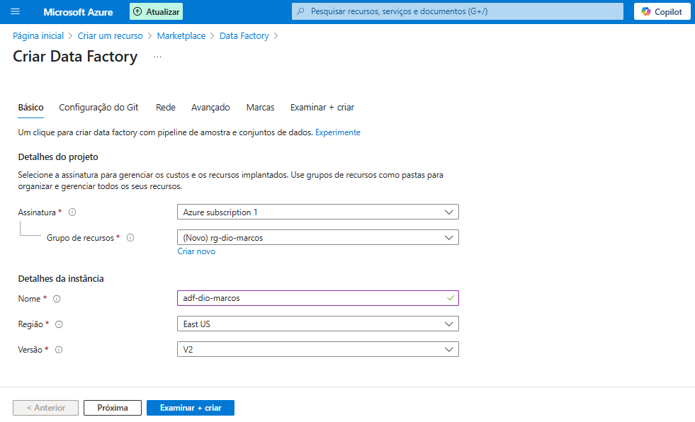
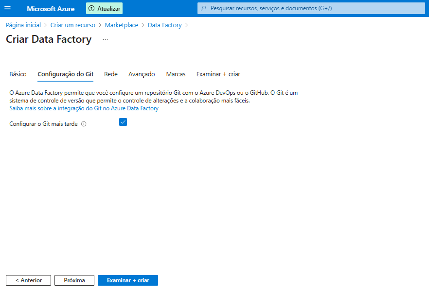
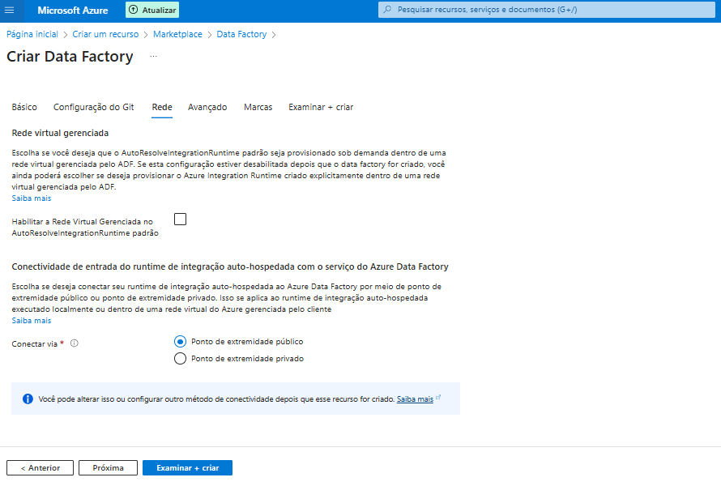
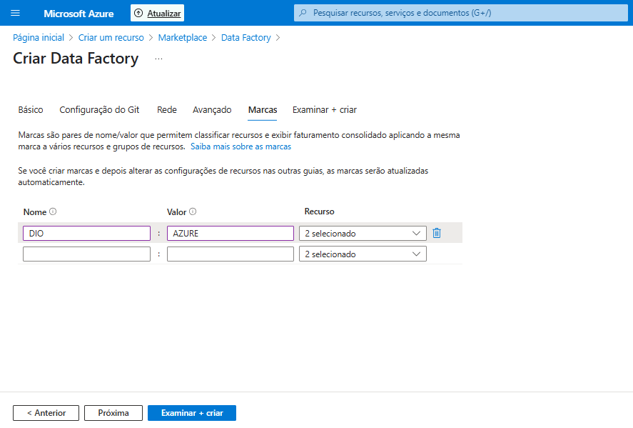
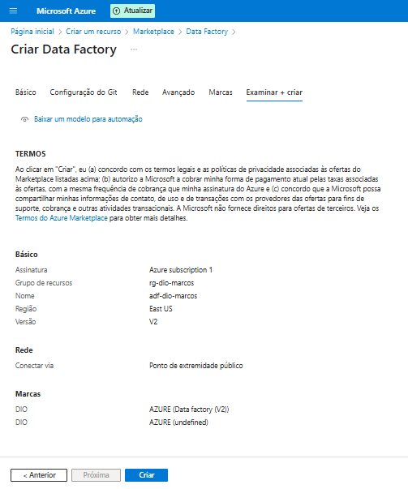

# 🚀 Criando meu Primeiro Data Factory na Azure 🏭

Bem-vindo(a) a este guia prático sobre como criar seu primeiro Azure Data Factory (ADF) diretamente no Portal do Azure! Este projeto demonstra os passos iniciais e também oferece scripts para automatizar a criação e configuração básica de monitoramento, como parte dos desafios propostos no curso **"Criando um Monitoramento de Custos no Data Factory"** do Bootcamp **Microsoft AI for Tech - Azure Databricks** na plataforma da [DIO](https://www.dio.me/).

Um agradecimento especial à professora **[Carol Lavecchia](https://www.linkedin.com/in/caroline-lavecchia/)** por propor este desafio e compartilhar seu conhecimento! ✨

 

## 🤔 Mas afinal, o que é o Azure Data Factory e para que serve?

Imagine que você tem dados espalhados por vários lugares: bancos de dados antigos, planilhas, arquivos em nuvem, APIs de serviços online... um monte de fontes diferentes! 🤯 Agora, imagine que você precisa juntar tudo isso, talvez dar uma limpada, transformar um pouco e levar para um lugar centralizado (como um Data Lake ou Data Warehouse) para análise.

É aí que entra o **Azure Data Factory (ADF)**! 🥳

Pense no ADF como um maestro 🧑‍🏫 ou um chef de cozinha de dados 🧑‍🍳 na nuvem da Microsoft (Azure). Ele não armazena os dados em si, mas **orquestra** todo o processo de:

1.  **Coleta (Ingestão):** Buscar os dados de diversas fontes.
2.  **Movimentação:** Transportar esses dados de um lugar para outro.
3.  **Transformação:** Modificar, limpar, enriquecer ou agregar os dados no caminho (processos de ETL/ELT).
4.  **Automação:** Agendar e monitorar esses fluxos de dados (pipelines) para que rodem automaticamente.

Resumindo: O ADF é a ferramenta do Azure para **criar, agendar e gerenciar pipelines de integração e transformação de dados** de forma escalável e confiável na nuvem. Ele te ajuda a transformar dados brutos em informações prontas para gerar insights! ☁️➡️💧➡️📊

 

## 🎯 Objetivo do Projeto

*   Demonstrar, passo a passo, como criar uma instância do Azure Data Factory utilizando o Portal do Azure.
*   Fornecer scripts (Python e Bash) para automatizar a criação do ADF, uma pipeline simples e a configuração de diagnóstico para monitoramento de custos via Log Analytics.

 

## 🛠️ Ferramentas Utilizadas

*   : Plataforma de nuvem.
*   : Serviço de orquestração de dados.
*   : Interface gráfica para criação manual.
*   : Linguagem de script para automação.
*   : Bibliotecas Python para interagir com o Azure.
*   : Shell script para automação.
*   : Ferramenta de linha de comando para interagir com o Azure.
*   : Ambiente de terminal no navegador para execução dos scripts.

 

## 🖥️ Etapas da Criação Manual no Portal Azure

Esta seção detalha a criação do Data Factory usando a interface gráfica do Portal Azure.

### 1. Configurações Básicas (Onde tudo começa!) 📝

Nesta primeira etapa, definimos as informações essenciais para nosso Data Factory.

  

*   **Assinatura:** Escolhemos a assinatura do Azure onde os custos serão cobrados.
*   **Grupo de Recursos:** Criamos um novo grupo chamado `rg-dio-marcos`.
    *   **Por que `rg-`?** É uma convenção de nomenclatura! Usar prefixos como `rg-` para *Resource Groups* ajuda a identificar e organizar rapidamente seus recursos no Azure. É como etiquetar suas pastas! 🏷️
*   **Nome da Instância:** Definimos como `adf-dio-marcos`.
    *   **Por que `adf-`?** Seguindo a mesma lógica, `adf-` indica que este recurso é um *Azure Data Factory*. Boas práticas de nomenclatura salvam vidas (ou pelo menos, muito tempo!). 😉 O nome precisa ser globalmente único.
*   **Região:** Selecionamos `East US`.
    *   **Importância da Região:** A escolha da região impacta a **latência** (escolha uma região próxima aos seus dados ou usuários), a **disponibilidade de serviços** e os **custos**. Pense bem onde faz mais sentido hospedar seu ADF! 📍💰
*   **Versão:** Mantivemos a `V2`, que é a versão mais recente e recomendada, oferecendo mais funcionalidades.

### 2. Configuração do Git (Versionamento? Depois!) ⏳

O Azure Data Factory permite integrar com repositórios Git (Azure DevOps ou GitHub) para versionamento de código, colaboração e CI/CD.

  

*   **Ação:** Marcamos a opção **"Configurar o Git mais tarde"**.
*   **Motivo:** Para este exemplo inicial, não precisamos configurar a integração com Git. Isso pode ser feito a qualquer momento após a criação do Data Factory, se necessário para projetos mais complexos ou colaborativos.

### 3. Configuração de Rede (Mantendo Simples!) 🌐

Aqui definimos como o Data Factory se conectará a outras fontes de dados e serviços.

  

*   **Ação:** Mantivemos as configurações padrão: **"Ponto de extremidade público"**.
*   **Motivo:** Para um aprendizado inicial, a conexão via ponto público é mais simples. Opções como Rede Virtual Gerenciada ou Pontos de Extremidade Privados aumentam a segurança, mas também a complexidade, sendo mais relevantes para ambientes corporativos com requisitos de segurança específicos.

### 4. Marcas (Etiquetas para Organização!) 🏷️

As Marcas (Tags) são pares de nome/valor que ajudam a categorizar e organizar seus recursos no Azure. São extremamente úteis para gerenciamento de custos e automação.

  

*   **Ação:** Adicionamos a marca `DIO` com o valor `AZURE`.
*   **Motivo:** Isso nos permite identificar facilmente todos os recursos relacionados a este projeto da DIO ou filtrar custos associados a ele. Imagine ter dezenas ou centenas de recursos; as tags se tornam essenciais!

### 5. Examinar + Criar (A Grande Finalização!) 🎉

A última aba apresenta um resumo de todas as configurações escolhidas antes de efetivamente criar o recurso.

  

*   **Ação:** Revisamos se tudo está conforme o esperado (Assinatura, Grupo de Recursos, Nome, Região, Tags, etc.). Se a validação passar (um ✔️ verde aparecerá), clicamos em **"Criar"**.
*   **Resultado:** O Azure começará o processo de *deploy* (implantação) do seu Data Factory. Aguarde alguns instantes e... pronto! Seu ADF estará criado e pronto para uso! ✨

 

## ⚙️ Automação via Scripts (Azure Cloud Shell)

Como alternativa à criação manual pelo portal, você pode usar os scripts fornecidos neste repositório para automatizar a criação do Data Factory, uma pipeline de exemplo e a configuração de diagnóstico para enviar logs ao Log Analytics Workspace.

Existem dois scripts disponíveis:

*   `adf_monitoramento_custos.py`: Utiliza o SDK do Azure para Python.
*   `setup_monitoramento_adf.sh`: Utiliza a Azure CLI (Bash).

**Como usar o script Bash (`setup_monitoramento_adf.sh`) no Azure Cloud Shell:**

1.  **Abra o Azure Cloud Shell:** Faça login no Portal Azure e clique no ícone do Cloud Shell (`>_`) na barra superior. Escolha o ambiente `Bash`.
2.  **Faça o Upload ou Clone:**
    *   **Opção 1 (Upload):** Clique no ícone de Upload/Download de arquivos no Cloud Shell e envie o arquivo `setup_monitoramento_adf.sh` para o seu diretório home.
    *   **Opção 2 (Clone):** Se o script estiver em um repositório Git, clone o repositório: `git clone https://github.com/MarcosWinther/project-azure-creating-cost-monitoring-in-Data-Factory` e navegue até a pasta: `cd src`.
3.  **Edite as Variáveis:** **Este passo é crucial!** Abra o script com um editor (como `nano` ou `code` no Cloud Shell) e **substitua os valores de placeholder** pelas suas informações reais:
    *   `nano setup_monitoramento_adf.sh`
    *   Altere `<SEU_ID_DE_ASSINATURA>`, `<SEU_RESOURCE_GROUP>`, `<NOME_DO_SEU_DATA_FACTORY>`, `<NOME_DO_WORKSPACE>` e `<RESOURCE_GROUP_DO_WORKSPACE>`.
    *   Salve as alterações (Ctrl+O em `nano`, depois Enter, e Ctrl+X para sair).
    *   **Atenção:** O script assume que o Log Analytics Workspace **já existe**. Certifique-se de que os nomes e o grupo de recursos do workspace estão corretos.
4.  **Torne o Script Executável:**
    *   `chmod +x setup_monitoramento_adf.sh`
5.  **Execute o Script:**
    *   `./setup_monitoramento_adf.sh`
6.  **Acompanhe a Saída:** O script exibirá mensagens indicando o progresso da criação dos recursos.

**Observação sobre o script Python (`adf_monitoramento_custos.py`):** Para usá-lo, você precisaria:
*   Garantir que as bibliotecas Python necessárias estão instaladas (`pip install azure-identity azure-mgmt-datafactory azure-mgmt-resource azure-mgmt-monitor`).
*   Editar as variáveis dentro do arquivo `.py` com suas informações.
*   Executar o script com `python adf_monitoramento_custos.py`.
*   A autenticação `DefaultAzureCredential` tentará usar as credenciais do Cloud Shell automaticamente.

 

## 👨‍💻 Expert

    
    
&nbsp&nbsp&nbspMarcos Winther 
    &nbsp&nbsp&nbsp
    <a href="https://github.com/MarcosWinther">
    GitHub</a>&nbsp;|&nbsp;
    <a href="https://www.linkedin.com/in/marcoswinthersilva/">LinkedIn</a>
    

  

---

⌨️ com 💜 por [Marcos Winther](https://github.com/MarcosWinther)